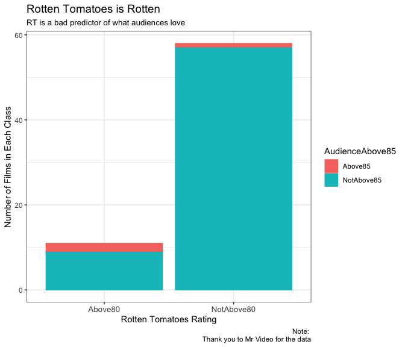
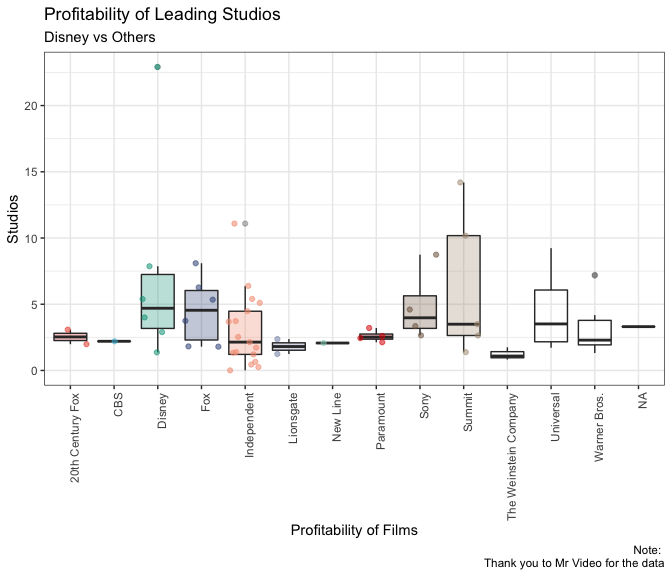
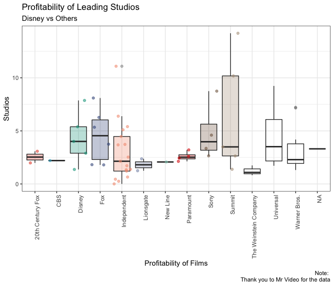
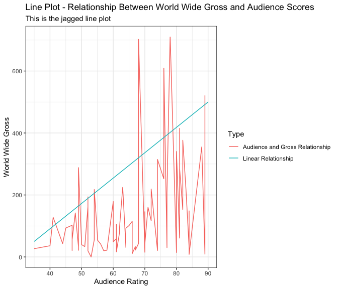
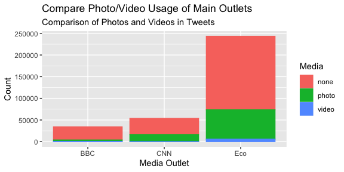
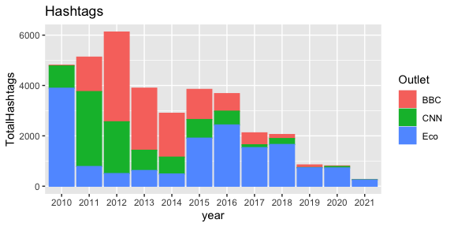

# Purpose

This README documents Zander Prinsloo’s (20065124) answers to the Data
Science test on Monday 24 May 2021. It describes how I go about
answering the three questions of the test, and also gives those answers
in the sections below. The sections are appropriately named *Question
1*, *Question 2*, and *Question 3*.

Note, however, that there are also sub-folders for each question. These
also have their own projects. Within those folders you will find,
amongst other things, a) pdfs with the answers to the relevant
questions, b) a code folder that contains specific code and functions
used in answering that question. The latter are sourced into this
README.

#### How I Got Started

Here is the code for how I created this folder, specifically the
*20065124.Rproj* and corresponding folders, as well as the
sub-directories for each question.

``` r
# Create the project - This is all commented out now. 
# LOCATION <- c("/Users/zanderprinsloo/Library/Mobile Documents/com~apple~CloudDocs/Desktop/Desktop – MacBookPro’s MacBook Pro/Academic/Postgraduate/Masters/Modules/Data Science/Test")
# fmxdat::make_project(FilePath = LOCATION, 
#                      ProjNam = "20065124", 
#                      Mac = T)
# # Create Projects for each question including Texevier template
# Texevier::create_template(directory = paste0(LOCATION, "/20065124"), 
#                           template_name = "Question1")
# Texevier::create_template(directory = paste0(LOCATION, "/20065124"), 
#                           template_name = "Question2")
# Texevier::create_template(directory = paste0(LOCATION, "/20065124"), 
#                           template_name = "Question3")
```

# Question 1

This section provides the answers for Question 1. Before answering the
question I need to a) do garbage collection, b) load important packages,
c) source relevant code from the `Question1/code`. This is done the
separate chunks below.

Garbage Collection:

    ##           used (Mb) gc trigger  (Mb) limit (Mb) max used (Mb)
    ## Ncells 1032771 55.2    2046882 109.4         NA  1720798   92
    ## Vcells 1817880 13.9    8388608  64.0      16384  2747585   21

## Task

I will seek to prove that movie critics were not a near perfect
prediction of a film’a popularity and profitability amongst audiences in
the mid-2000s. In order to do that I use the **Movies.csv** data set
given to me by my friend at *Mr Video*. I will try to disprove her
claims using plots throughout.

## Claim 1

She claims that: *:if a movie had a rating of more than 80% on Rotten
Tomatoes, audiences would rate it above 85% every time."*

The barplot below clearly shows that my friend’s claim is false. For the
films that Rotten Tomatoes rated above 80, an overwhelming majority was
not rated above 85 by audiences.

<div class="figure" style="text-align: center">


<p class="caption">
Caption Here
</p>

</div>

## Claim 2

The second claim is that *“Disney films may not have the highest
grossing numbers, but they’ve always been the most profitable of all the
leading studios.”*

I will show that they have not always been the most profitable out of
the leading studios.

There is one film called Fireproof that has a very high profitability of
66.934. It is an outlier that will be excluded from the plot along with
any missing values of profitability or studios.

    ## # A tibble: 1 x 8
    ##   Film    Genre `Lead Studio` `Audience  score … Profitability `Rotten Tomatoes…
    ##   <chr>   <chr> <chr>                      <dbl>         <dbl>             <dbl>
    ## 1 Firepr… Drama Independent                   51          66.9                40
    ## # … with 2 more variables: Worldwide Gross <dbl>, Year <dbl>

In we see that Disney is not clearly the most profitable film. While
it’s median is very close to Fox, Sony, and Summit, it’s upper quintile
is substantially lower than Summit. Note also that Disney is being
pulled up by an outlier, High School Musical 3: Senior Year

<div class="figure" style="text-align: center">


<p class="caption">
Boxplot Comparing Disney’s Profitability
</p>

</div>

If we remove this outlier, we get . It shows that Disney is an average
performer in terms of Profitability. It’s median is lwoer than Fox, and
its upper quintile appears lower than Fox, Sony, Summit, and Universal
Studios.

<div class="figure" style="text-align: center">


<p class="caption">
Boxplot Comparing Disney’s Profitability
</p>

</div>

Therefore, it is not clear that Disney is indeed more profitable. The
plots indicate that there are a number of studios that are more
profitable and more consistent.

## Claim 3

The third claim is that *“Audiences are always drawn to the highest
grossing films”*. She goes further to claim that the correlation between
world wwide grossing numbers and audience scores would be near 80%.

<!-- The correlation between these two variables is 71, 81, 89, 64, 84, 80, 66, 80, 51, 52, 47, 52, 56, 61, 60, 76, 57, 63, 77, 58, 45, 83, 49, 62, 55, 62, 55, 40, 61, 76, 77, 84, 70, 50, 70, 84, 48, 67, 64, 66, 54, 49, 47, 82, 74, 61, 70, 81, 49, 60, NA, 88, 47, 81, 68, 41, 47, 74, 65, 78, 68, 82, 68, 47, 54, 53, 67, 89, 72, 72, 44, 35, 52, 70, 160.308654, 60.72, 8.972895, 30.68, 29.367143, 14.31, 114.97, 340.487652, 33.467, 161.834, 102.22, 193.967, 42.05, 59.192128, 178.84, 252.044501, 20.1, 224.6, 30.147, 21.569, 93.4, 219.001261, 32.59, 79.18, 69.307224, 96.16, 54.53, 36.08, 105.962734, 609.473955, 206.073, 148.66, 15.173694, 39.664, 145.896422, 8.258, 142.04, 33.527293, 92.60105, 10.7, 55.241, 21.37, 20.71, 153.093505, 20.741996, 16.61, 55.86, 415.253258, 288.35, 48.81, 60.183, 355.08, 77.09, 285.431, 43.305978, 127.76665, 32.4, 314.7, 101.33, 709.82, 205.3, 376.661, 702.17, 55.862886, 217.57, 0.025, 22.179483, 521.283432, 117.094, 219.367646, 43.04, 26.66, 19.62, 41.941 -->

Note that gives the relationship between world wide gross and audience
rating. The linear line is shows what a strong correlation would look
like. However, the actual line plot of the relationship between world
wide gross and audience scores is much more jagged and sporadic. There
is not a clear linear relationship and correlation. This means that the
third claim also appears false.

<div class="figure" style="text-align: center">


<p class="caption">
Jagged Line Plot of Gross and Rating
</p>

</div>

# Question 2

# Task

Some interesting findings using the Forbes data set

# Plot 1

<div class="figure" style="text-align: center">


<p class="caption">
Names of Rich People
</p>

</div>

This plot in shows that there is a surprisingly high requency of rich
people with (‘Common’) names John, Mike/Michael, James, or Bill.
Similarly, there are quite a number of families that make up the
Billionaires on Forbes’ list.

# Question 3

For this question I will give a barplot to show the composition of
tweets that use photos and videos for the different media outlets

<div class="figure" style="text-align: center">


<p class="caption">
Compare Videos and Photos of Outlets
</p>

</div>

# Question 3b

Now I do a similar plot to compare the quantity of hashtags

<div class="figure" style="text-align: center">


<p class="caption">
Caption Here
</p>

</div>
